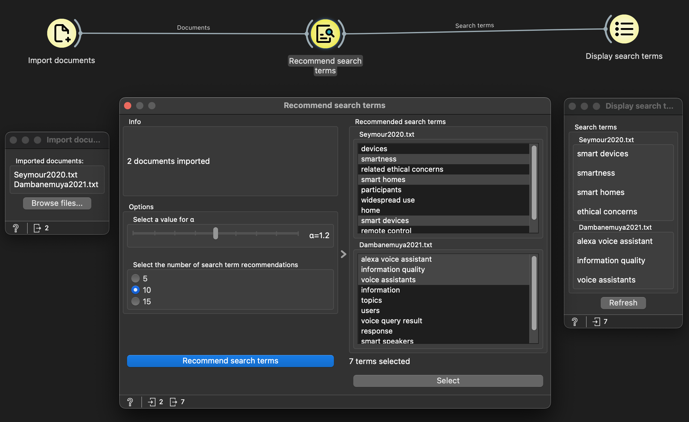

# Search Term Recommender
The [Search Term Recommender](https://search-term-recommender.readthedocs.io/en/latest/index.html) is an add-on for [Orange3](https://orangedatamining.com/), a data mining software which allows users to build data mining workflows by visual programming. This add-on supports researchers in finding search terms for a systematic literature review (SLR) by recommending search terms based on a set of relevant input documents using the Keyphrase extraction method [MPRank](https://doi.org/10.18653/v1/N18-2105). 

The add-on consists of three widgets:
- [Import documents](https://search-term-recommender.readthedocs.io/en/latest/importer.html) 
- [Recommend search terms](https://search-term-recommender.readthedocs.io/en/latest/recommender.html)
- [Display search terms](https://search-term-recommender.readthedocs.io/en/latest/displayer.html)


## Installation
1. Create a conda environment like so:
    ```
    conda create python=3.10 --platform osx-64 --name search-term-recommender
    ```

2. Install Orange3 (version 3.38.0):
    ```
    conda install orange3=3.38.0
    ```

3. Install [pke](https://github.com/boudinfl/pke/tree/master), an open source python-based toolkit for keyphrase extraction as specified in the README: 
    ```
    pip install git+https://github.com/boudinfl/pke.git
    ```

4. Download the English language model for SpaCy:
    ```
    python -m spacy download en_core_web_sm
    ```

5. Clone the repository:
    ```
    git clone https://github.com/liaaneeee/Search-Term-Recommender.git
    ```

6. Pip install the add-on from the root directory:
    ```
    pip install .
    ```


## Usage
1. Make sure the conda environment you set up for Orange is activated
2. Launch Orange by running either `orange-canvas` or `python -m Orange.canvas` from the command line
3. The Add-on should appear as a category called **"Search Term Recommender"** in Orange. The category contains three widgets: **Import documents**, **Recommend search terms** and **Display search terms**. For more detailed usage information please refer to the [help pages](https://search-term-recommender.readthedocs.io/en/latest/) of the Add-on.

## Example

